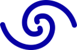

# Corryvreckan
### The Maelstrom for Your Test Beam Data

For more details about the project please have a look at the website at https://cern.ch/corryvreckan.

[](https://gitlab.cern.ch/simonspa/corryvreckan/commits/master)

## Dependencies
* [ROOT](https://root.cern.ch/building-root) (required, with the GenVector component)

## Installation
The CMake build system is used for compilation and installation. The install directory can be specified by adding `-DCMAKE_INSTALL_PREFIX=<prefix>` as argument to the CMake command below. Other configuration options are explained in the manual.

The dependencies need to be initialized for the build to succeed.

### Compilation
To compile and install a default installation of Corryvreckan, run the following commands

```
$ mkdir build && cd build/
$ cmake ..
$ make install
```

For more detailed installation instructions, please refer to the documentation below.

### Uninstallation
To uninstall and remove compilation files (e.g. when you want to do a clean recompilation/reinstallation):

```
$ rm -r build/ lib/ bin/
```

N.B. This assumes you used the above commands to compile and install. Adjust the paths accordingly if you used a different `build` directory and/or `CMAKE_INSTALL_PREFIX` option.

## Documentation
The PDF user manual is automatically compiled by the continuous integration and can be [downloaded here](https://gitlab.cern.ch/corryvreckan/corryvreckan/-/jobs/artifacts/master/raw/public/usermanual/corryvreckan-manual.pdf?job=cmp%3Ausermanual).

The latest PDF version of the User Manual can be created from source by executing
```
$ make pdf
```
After running the manual is available under `usermanual/corryvreckan-manual.pdf` in the build directory.

To build the HTML version of the latest Doxygen reference, run the following command
```
$ make reference
```
The main page of the reference can then be found at `reference/html/index.html` in the build folder.

## Development of Corryvreckan

Corryvreckan is developed and maintained by

* Lennart Huth, DESY, @lhuth
* Paul Schütze, DESY, @pschutze
* Simon Spannagel, DESY, @simonspa

The following authors, in alphabetical order, have developed or contributed to Corryvreckan:

* David Bacher, ETH Zürich, @dabacher
* Pascal Becht, University of Heidelberg, @pbecht
* Bogdan-Mihail Blidaru, University of Heidelberg, @mblidaru
* Matthew Daniel Buckland, University of Liverpool, @mbucklan
* Carsten Daniel Burgard, DESY, @cburgard
* Eric Buschmann, CERN, @ebuschma
* Maximilian Felix Caspar, DESY, @mcaspar
* Chun Cheng, DESY, @chengc
* Manuel Colocci, CERN, @mcolocci
* Dominik Dannheim, CERN, @dannheim
* Jens Dopke, STFC RAL, @jdopke
* Katharina Dort, University of Giessen/CERN, @kdort
* Jordi Duarte-Campderros, IFCA, @duarte
* Finn Feindt, DESY, @ffeindt
* Alexander Ferk, CERN, @aferk
* Adrian Fiergolski, CERN, @afiergol
* Sejla Hadzic, MPP, @sehadzic
* Jan Hammerich,University of Liverpool, @jhammeri
* Adrian Herkert, DESY, @adherker
* Daniel Hynds, Nikhef, @dhynds
* Nicolò Jacazio, CERN, @njacazio
* Callan Jessiman, Carleton University, @cjessima
* Jens Kroeger, University of Heidelberg/CERN, @jekroege
* Magnus Mager, CERN, @mmager
* Keerthi Nakkalil, University Bonn/DESY, @nakkalil
* Andreas Matthias Nürnberg, KIT, @nurnberg
* Ryunosuke O'Neil, University of Edinburgh, @roneil
* Younes Otarid, DESY, @yotarid
* Klaas Padeken, Bonn, HISKP, @padeken
* Florian Pitters, HEPHY, @fpipper
* Tomas Vanat, CERN, @tvanat
* Annika Vauth, University of Hamburg/DESY, @anvauth
* Mateus Vicente Barreto Pinto, University Geneva, @mvicente
* Morag Williams, University of Glasgow/CERN, @williamm
* Philipp Windischhofer, University of Chicago, @phwindis
* Jin Zhang, DESY, @jinz
* Bong-Hwi Lim, University of Turin, @blim

## Citations
The reference paper of Corryvreckan describing the framework and providing an example for a test beam data reconstruction has been published in the *Journal of Instrumentation*.
The paper is published with open access and can be obtained from here:

https://doi.org/10.1088/1748-0221/16/03/P03008

Please cite this paper when publishing your work using Corryvreckan as:

> D. Dannheim et al., “Corryvreckan: a modular 4D track reconstruction and analysis software for test beam data”, J. Instr. 16 (2021) P03008, doi:10.1088/1748-0221/16/03/P03008, arXiv:2011.12730

A preprint version is available on [arxiv.org](https://arxiv.org/abs/2011.12730).

In addition, the software can be cited using the [versioned Zenodo record](https://doi.org/10.5281/zenodo.4384170) or the current version as:

>  M. Williams, J. Kröger, L. Huth, P. Schütze, S. Spannagel. (2020, December 22). Corryvreckan - A Modular 4D Track Reconstruction and Analysis Software for Test Beam Data
> (Version 2.0). Zenodo. http://doi.org/10.5281/zenodo.4384186

## Contributing
All types of contributions, being it minor and major, are very welcome. Please refer to our [contribution guidelines](CONTRIBUTING.md) for a description on how to get started.

Before adding changes it is very much recommended to carefully read through the documentation in the User Manual first.

## Licenses
This software is distributed under the terms of the MIT license. A copy of this license can be found in [LICENSE.md](LICENSE.md).

The documentation is distributed under the terms of the CC-BY-4.0 license. This license can be found in [doc/COPYING.md](doc/COPYING.md).

This project strongly profits from the developments done for the [Allpix Squared project](https://cern.ch/allpix-squared) which is released under the MIT license. Especially the configuration class, the module instantiation logic and the file reader and writer modules have profited heavily by their corresponding framework components in Allpix Squared.

The LaTeX and Pandoc CMake modules used by Corryvreckan are licensed under the BSD 3-Clause License.

The General Broken Lines library for track fitting is distributed under the terms of the GNU General Public License version 2. The license can be found [here](3rdparty/GeneralBrokenLines/COPYING.LIB), the original source code is available from [here](https://gitlab.desy.de/claus.kleinwort/general-broken-lines/).

The Magic Enum library by Daniil Goncharov is published under the MIT license, the code can be found [here](https://github.com/Neargye/magic_enum).
